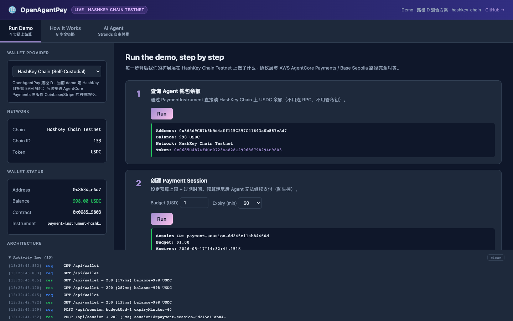
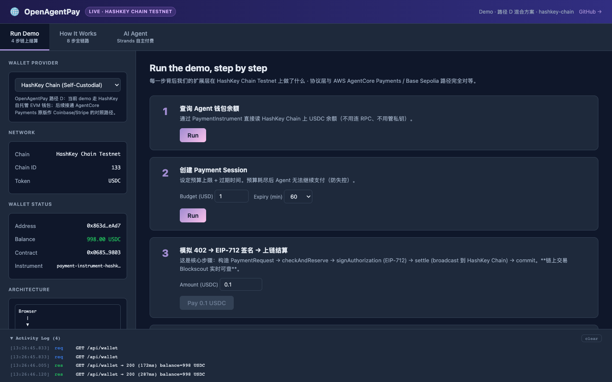
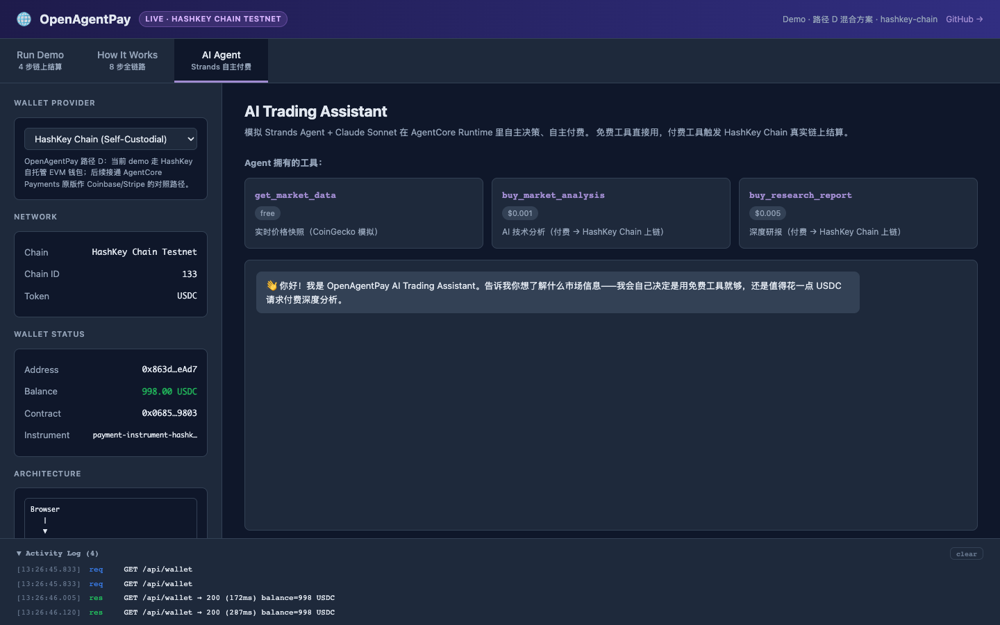

# OpenAgentPay

> 🌐 **Open, pluggable Agent Payments platform** for AWS Bedrock AgentCore — any wallet, any protocol, any governance.

[](LICENSE)
[](https://d1p7yxa99nxaye.cloudfront.net)
[](https://aws.amazon.com/bedrock/agentcore/)
[](https://testnet-explorer.hsk.xyz/address/0x0685C487Df4Cc0723Aa828C299686798294E9803)
[](https://sepolia.basescan.org/address/0x851C03756D5e9e057cb518C1B3cd47f628a0Dca7)
[](#)
[](./packages/governance/)

> **🌐 Live demo**: https://d1p7yxa99nxaye.cloudfront.net （已部署到 AWS us-east-1，CloudFront + Lambda + Secrets Manager）
>
> **🚀 Path D Hybrid 完成 (2026-05-19)**: OpenAgentPay 现在**同时**支持两个生产级钱包连接器：
> - 🇭🇰 **HashKey Chain** (亚洲, MockUSDC, 自托管 EVM)
> - 🇺🇸 **Coinbase CDP** (北美, Circle 官方 USDC, 托管 Base Sepolia)
>
> 共享同一个 `WalletConnector` 接口，UI 一键切换，业务代码 0 改动。
> Framework-agnostic 抽象证明完成。详见 [📋 CHANGELOG](./CHANGELOG.md) ·
> [🔬 HashKey demo](./docs/HASHKEY_DEMO.md) ·
> [⚡ Quickstart](./docs/QUICKSTART.md)。

---

## 🚀 What you'll see in 5 minutes

```bash
git clone https://github.com/neosun100/openAgentPay && cd openAgentPay
pnpm install
# (configure .env.local — see docs/QUICKSTART.md)
pnpm demo
# → open http://localhost:5173
```



> **Live update (2026-05-17)**: OpenAgentPay 的端到端 demo 已经在
> **HashKey Chain Testnet** 上跑通：从 Vite + React 三 Tab UI →
> Express API → `PaymentManager` → `HashKeyChainConnector` →
> EIP-3009 `transferWithAuthorization` → 链上 settlement 真实可查。
>
> **协议层与 AWS AgentCore Payments / Coinbase CDP / Base Sepolia 路径完全对等**
> ——业务代码层面只换一行 `walletProvider`。详见
> [📋 战略文档](./docs/STRATEGY.md) ·
> [⚡ Quickstart](./docs/QUICKSTART.md) ·
> [🔬 HashKey 链上 demo 复现指南](./docs/HASHKEY_DEMO.md)。

---

## ✨ What is OpenAgentPay?

OpenAgentPay 是面向 AI Agent 经济的**开放式支付协议平台**。它在 AWS Bedrock AgentCore Payments (Preview) 之上，提供一套可插拔的 Wallet / Protocol / Governance 三层抽象，让任何钱包、任何协议、任何企业治理逻辑都能即插即用接入。

**类比**：Kubernetes 之于容器编排（CRI/CSI/CNI 标准化），OpenAgentPay 想做 Agent Payments 的 **CRI 时刻**。

### 解决什么问题？

AWS AgentCore Payments 当前 Preview 只支持 **Coinbase CDP** 和 **Stripe Privy** 两个钱包 + **x402** 协议。这对：

- 🇭🇰 **HashKey** 等亚洲合规交易所客户（持牌、做 RWA、做 HKD 稳定币 HKDR）
- 🇨🇳 **Binance Pay / OKX / Bitget** 等亚洲 CEX
- 🌐 **Web3-native** 客户（MetaMask / WalletConnect）
- 💳 **传统支付场景**（支付宝 / 微信 / Stripe 信用卡）

—— 全部不可用。

OpenAgentPay 让你**保留 AgentCore 的 Runtime / Identity / Gateway / Observability**，仅替换 Payments 模块的 **Wallet Connector** + **Protocol Adapter** 两层 → 适配上述所有场景。

详细战略 + 路径选择 + 资产分级 → 见 [📋 docs/STRATEGY.md](./docs/STRATEGY.md)。

---

## 🤔 为什么需要两个协议？x402 + OAP-CEX 双轨

> 演讲常被问到的核心问题：**"既然 x402 这么好，为什么 Binance 不直接用 x402？"**

**简短回答**：x402 是**链上协议**，但 Binance / OKX / Bitget 这类 CEX **结构上不上链**。强行套 x402 等于让中心化数据库假装成 ERC-20 合约——既笨拙又违背 CEX 的低成本优势。

**详细对比**：

| 维度 | x402（链上路径） | OAP-CEX（CEX 路径） |
|---|---|---|
| **签名层** | EIP-712 typed data + secp256k1 ECDSA | 钱包商 API key + HMAC-SHA256/512 |
| **结算层** | 公链上 EIP-3009 `transferWithAuthorization` | CEX 内部账本记账（off-chain） |
| **接收方标识** | 以太坊地址 `0x...` | CEX 内部 merchant ID |
| **谁付 gas** | Facilitator 替 Agent 付 gas | 没有 gas（CEX 不上链） |
| **结算时间** | ~5 秒（取决于链） | ~50ms（CEX 内部记账） |
| **成本** | gas + facilitator 费用 | 钱包商收取 % 手续费（一般更低） |
| **适用钱包** | Coinbase CDP · Stripe Privy · HashKey Chain · MetaMask · WalletConnect · 任何 EIP-3009 EVM 钱包 | Binance Pay · OKX Pay · Bitget Wallet · Bybit · HashKey Pro Sandbox · 未来支付宝/微信 |

**关键 insight**：x402 协议的**形状**很好（402 challenge → sign → retry），但**加密层应该可插拔**。所以我们：

- **x402** = 协议形状 + **EIP-712 签名层**（链上钱包用）
- **OAP-CEX** = 同样的协议形状 + **HMAC 签名层**（CEX 用）

两个协议**共享 ProtocolAdapter 接口**——`PaymentManager` 通过 ProtocolRouter 自动按 402 response signature 派发。开发者业务代码层面**只换一行 `walletProvider`**，剩下都是协议层自动处理。

这就是为什么 OpenAgentPay 既能跑通 HashKey Chain 链上结算（x402），也能跑通 Binance Pay CEX 内部结算（OAP-CEX）——**用同一套 PaymentManager**。

<p align="center">
  
</p>

**协议规范全文**：[`packages/protocol-cex-pay/doc/SPEC.md`](./packages/protocol-cex-pay/doc/SPEC.md) （24 页 IETF-style draft，向后兼容 x402）。

---

## 🎬 Live Demo

### Tab 1: Run Demo · 4 步手动跑链上结算



四步流程：
1. **GET /api/wallet** → live 链上 USDC 余额
2. **POST /api/session** → 创建 Payment Session（预算 + TTL）
3. **POST /api/pay** → EIP-712 签名 + Facilitator 上链结算（**~5 秒**）
4. **GET /api/session/:id** → Session 累计花费

### Tab 2: How It Works · 8 步全链路图



每一步配 OpenAgentPay 实现细节。Step 6 显示 EIP-712 typed data 完整结构，Step 7 显示 ecrecover 合约逻辑。

### Tab 3: AI Agent · 真 Strands 风格


3 个工具（free + 2 paid）+ 3 个预设 prompt。付费按钮触发**真实链上结算**，免费按钮纯 mock。

---

## 🏗️ 架构

### Live deployment（部署架构）

<p align="center">
  
</p>

> Browser → CloudFront → API Gateway HTTP API → Lambda → HashKey Chain Testnet
>
> 全链路真实运行，无 Lambda 公网入口（合规架构），私钥在 Secrets Manager（KMS-encrypted）。

### OpenAgentPay 平台 5 层架构

<p align="center">
  
</p>

> 协议层（x402 / OAP-CEX）和钱包连接器（HashKey Chain / Binance Pay / Coinbase CDP / ...）都是**可插拔**的。换钱包只需改一行 `walletProvider`。

---

## 📦 项目结构

```
openagentpay/
├── packages/
│   ├── core/                       # PaymentManager + types + SessionManager
│   ├── wallet-binance/             # Binance Pay Connector (OAP-CEX)
│   ├── wallet-hashkey/             # HashKey Chain Connector (x402, EVM) ⭐
│   ├── wallet-coinbase-cdp/        # Coinbase CDP Connector (x402, Base Sepolia) ⭐
│   ├── governance/                 # 7-Layer Guardrail: Policy + Compliance + Audit ⭐
│   ├── langchain-plugin/           # LangChain Tool — Layer 1 framework plugin ⭐
│   ├── strands-plugin/             # Strands plugin (Python) — Layer 1 framework plugin ⭐ NEW
│   ├── protocol-cex-pay/           # OAP-CEX Protocol Adapter (24-page IETF-style spec)
│   ├── strands-plugin/             # Strands Plugin (Python, planned)
│   ├── cdk-deploy/                 # AWS CDK Infrastructure
│   └── python-sdk/                 # Python SDK
├── apps/
│   ├── demo-api/                   # Express server (→ API Gateway → Lambda)
│   │                               # ↳ Path D Hybrid: routes by walletProvider param
│   └── demo-web/                   # Vite + React three-tab UI
│                                   # ↳ Capability bar with live + roadmap chips
├── scripts/
│   ├── binance-smoke.ts            # Binance Pay sandbox e2e
│   ├── hashkey-smoke.ts            # HashKey Chain Testnet e2e (TS)
│   ├── coinbase-cdp-smoke.ts       # Coinbase CDP + Base Sepolia e2e ⭐ NEW
│   ├── cdp-ping.ts                 # CDP credential check
│   └── hashkey/                    # MockUSDC + Python e2e ref impl
└── docs/
    ├── STRATEGY.md                 # 项目北极星文档
    ├── HASHKEY_DEMO.md             # HashKey Chain demo 复现指南
    └── QUICKSTART.md               # 5 分钟跑通 demo
```

---

## 🌐 链上事实（已验证）

OpenAgentPay 不是想法，是已经在 HashKey Chain Testnet 上跑通的事实：

| 资源 | Address / Hash | 链接 |
|---|---|---|
| **MockUSDC 合约** | `0x0685C487Df4Cc0723Aa828C299686798294E9803` | [👁 Contract](https://testnet-explorer.hsk.xyz/address/0x0685C487Df4Cc0723Aa828C299686798294E9803) |
| 部署 tx | `0xb9bdfdb1...` | [📜 Tx](https://testnet-explorer.hsk.xyz/tx/0xb9bdfdb1a975413dab1825824a88cedfea1418e5edb85c3549255b9f2098f50d) |
| Python e2e tx | `0xff8a175e...` | [📜 Tx](https://testnet-explorer.hsk.xyz/tx/0xff8a175e3f4b41a30b67940a4b654d7791742d76421d53a33dd976e8a51ccbf5) |
| TypeScript e2e tx | `0x5c10e2ae...` | [📜 Tx](https://testnet-explorer.hsk.xyz/tx/0x5c10e2ae5a152169c5870ce440f7ee2c5bbd26410690d8424af79d547df5f098) |

**两个完全独立的实现（Python + TypeScript）产生完全相同的链上效果**——证明协议层抽象正确。

---

## 🚀 Quick Start

详细 5 分钟指南：[docs/QUICKSTART.md](./docs/QUICKSTART.md)

```bash
git clone https://github.com/neosun100/openAgentPay
cd openAgentPay
pnpm install
# 配置 .env.local（见 QUICKSTART）
pnpm demo
# → http://localhost:5173
```

也能跑命令行 smoke test：

```bash
pnpm smoke:hashkey   # TypeScript 端到端 → 真上链
# 或
python3 scripts/hashkey/transfer-with-auth.py   # Python ref impl
```

---

## 🛡️ 7-Layer Guardrail · 借鉴 AgentCore Payments 的开源实现

> **新增 (v0.4.0)**：OpenAgentPay 把 AgentCore Payments 的 7 层 Guardrail 设计**开源化、可插拔化**。每一层都是独立 OSS 组件，可以单独替换实现。Layer 3/5/7 由 [`@openagentpay/governance`](./packages/governance/) 提供。

<p align="center">
  
</p>

| # | 层 | 实现 | 状态 |
|---|---|---|---|
| 1 | 🔐 Authorization | 交给上游 auth (Cognito/OIDC/SAML) | out of scope |
| 2 | 📋 **Session** | `@openagentpay/core` SessionManager | ✅ |
| 3 | 📐 **Policy** | `@openagentpay/governance` PolicyEngine（6 内置 + 自定义）| ✅ NEW v0.4.0 |
| 4 | ⛓️ **On-chain** | wallet connectors via EIP-3009 | ✅ |
| 5 | 🛡️ **Compliance** | `@openagentpay/governance` ComplianceChecker（Static / Chainalysis / TRM） | ✅ NEW v0.4.0 |
| 6 | 🔑 **Identity** | AWS Secrets Manager + KMS · Coinbase CDP TEE | ✅ |
| 7 | 📜 **Audit** | `@openagentpay/governance` AuditLogger（pluggable sinks） | ✅ NEW v0.4.0 |

**试一试**：[https://d1p7yxa99nxaye.cloudfront.net](https://d1p7yxa99nxaye.cloudfront.net) → **Guardrail** tab，看 7 层实时状态 + 一键触发 Policy deny / Sanctions match + 实时 audit log。

详细文档：[📋 docs/GOVERNANCE.md](./docs/GOVERNANCE.md)（含每层实现细节 + 与 AgentCore Payments 对照表）

---

## 🗺️ Roadmap

> 这个 roadmap **不写时间**——OpenAgentPay 的核心抽象（`WalletConnector` + `ProtocolAdapter`）已经验证正确，剩下的扩展全是按通用接口的机械工作，**接入一个新钱包通常只需要 1-2 天**。具体节奏跟随生态进展和合作伙伴需求。

### ✅ Phase 1 · MVP demo（已完成 2026-05-17）
- [x] 项目脚手架 + Apache 2.0
- [x] WalletConnector + ProtocolAdapter 接口定义
- [x] **Binance Pay Connector**（OAP-CEX 协议路径）
- [x] **OAP-CEX v0.1 协议**规范 + adapter
- [x] **PaymentManager** 顶层抽象（对齐 AgentCore Payments）
- [x] **MockUSDC + EIP-3009** 部署到 HashKey Chain Testnet
- [x] **HashKey Chain Connector**（x402 路径，TypeScript）
- [x] Python 参考实现 + TypeScript 实现——**两份独立代码产生相同链上效果**
- [x] Express API server + Vite React 三 Tab UI
- [x] 端到端 demo 跑通（local + AWS 生产）

### ✅ Phase 2 · AWS 生产部署（已完成 2026-05-17）
- [x] CDK Stack：API Gateway HTTP API + Lambda + CloudFront + S3 + Secrets Manager (KMS)
- [x] 浏览器 → CloudFront → Lambda → Secrets Manager → HashKey Chain 全链路真实运行
- [x] **Live URL**: https://d1p7yxa99nxaye.cloudfront.net
- [x] AWS Lambda 上链 verified ([tx 0xd18cb0f1...](https://testnet-explorer.hsk.xyz/tx/0xd18cb0f19359bdaae17aa89a0e14c47ccb7793579b9a09ac0423eefb1390a06a))

### 🌱 Phase 3 · 通用钱包接入（持续演进）

**核心理念**：任何钱包，只要满足 `WalletConnector` 接口的 5 个方法，都能即插即用接入。我们提供：
- 📐 **接入指南** + 模板 fork（参考 `packages/wallet-hashkey/` 或 `packages/wallet-coinbase-cdp/`）
- ✅ **conformance test 套件**（全过即合规）
- 📦 **自动发布到 npm**（merge 即 publish）

**钱包接入状态**：

| 类别 | 钱包 | 协议路径 | 状态 |
|---|---|---|---|
| **EVM 自托管（x402 路径）** | **HashKey Chain** ✅ · MetaMask · WalletConnect · Rabby · Safe (multi-sig) · Rainbow · Phantom (EVM) | x402 v1 | HashKey **production-grade** · 其余 roadmap |
| **AWS 原版兼容（managed）** | **Coinbase CDP** ✅ · Stripe Privy · Magic.link · Web3Auth · Crossmint · Fireblocks · Anchorage | x402 v1 | **CDP 已接入** · 其余 roadmap |
| **非 EVM 链** | Solana Pay · Sui Pay · Stellar (SEP-29) · Lightning Network (LN-402) · Aptos · Polygon | per-chain protocol | roadmap |
| **CEX-API（OAP-CEX 路径）** | **Binance Pay** ✅ · OKX Pay · Bitget Wallet · Bybit Pay · HashKey Pro · Bitfinex · KuCoin | OAP-CEX v0.1 | Binance done · 其余按需触发 |
| **传统支付** | Stripe (Card) · Alipay · WeChat Pay · PayPal · Apple Pay · Google Pay · Venmo · Cash App | AP2 / W3C-PR / OAP-CEX | roadmap |

**当前已实现**（生产可用）：
- ✅ **HashKey Chain** — TypeScript + Python 双实现，4 笔链上 tx 验证
- ✅ **Coinbase CDP** — Base Sepolia + Circle 官方 USDC，4 笔链上 tx 验证（含从 CloudFront 生产 Lambda 路径）
- ✅ **Binance Pay** — 协议层签名验证，20 unit tests pass

**接入速度**：客户提需求 + 钱包方有 API，**1-2 天内 ship 新 connector** 到 npm。

### 🌳 Phase 4 · 标准化与生态（持续推进）

- **协议提案**：把 OAP-CEX v0.1 推进 IETF/W3C
- **AgentCore 原生集成**：与 AWS Bedrock AgentCore Payments 团队对接，让 OpenAgentPay 成为官方扩展层
- **稳定币原生支持**：USDC ✅ · HKDR（HashKey 港币）· FDUSD · USDT · WHSK · 任何 EIP-3009 兼容 ERC-20 都自动支持
- **商业版 SaaS**：Self-hosted facilitator 之上的托管运营

**节奏**：跟随生态成熟度——上述大多数项目都不需要"几个月"，而是"看到信号就行动"。OpenAgentPay 的协议层已经为这些场景留好了 plug-in 点。

---

## 🤝 How to Add Your Own Wallet

1. Fork `packages/wallet-hashkey/` 作为模板
2. 实现 `WalletConnector` 接口（5 方法）
3. 加 conformance tests（5 个标准测试，全过即通过）
4. 提 PR
5. 合并后自动发布到 npm

---

## 📚 Related

- [AWS Bedrock AgentCore Payments (Preview)](https://aws.amazon.com/bedrock/agentcore/) — 我们扩展的对象
- [x402 Protocol](https://www.x402.org/) — 主流协议之一
- [HashKey Chain Docs](https://docs.hsk.xyz/) — 我们 demo 跑的链
- [研究报告](https://github.com/neosun100/fsidnb-agentcore-payment) — AgentCore Payments 完整深度分析

---

## 📝 License

[Apache License 2.0](LICENSE) © 2026 Neo Sun and OpenAgentPay Contributors

> 本项目**不代表 AWS / Coinbase / Stripe / Binance / HashKey 任何官方立场**，是独立开源生态项目。

---

*Status: MVP demo live · Last updated 2026-05-17*
